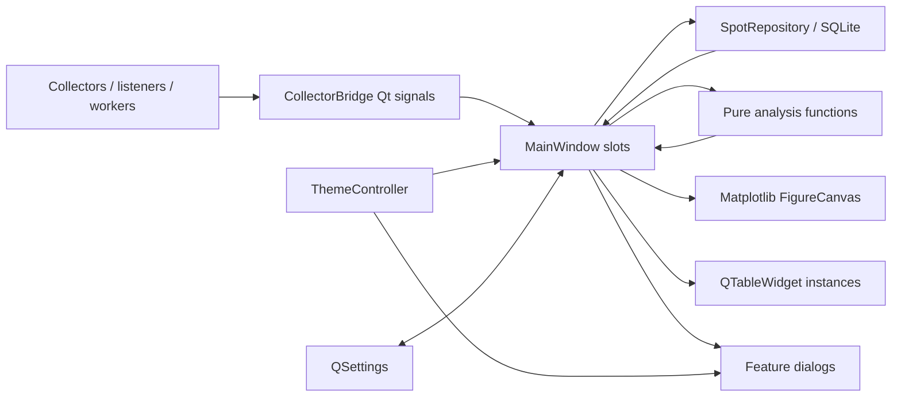

# UI architecture: baseline and implemented decomposition

Audit date: 2026-07-23

## Current ownership map

`app.py` creates `QApplication`, opens the local SQLite repository, constructs
`MainWindow`, schedules onboarding and update checks, and enters the Qt event
loop.

`ui.py` is 3,021 lines. Its single `MainWindow` owns:

- the English and Czech main-window translation dictionary;
- all main-window widget construction and menus;
- collection, history, import/export, clearing, and demo-data actions;
- filter state and QSettings persistence;
- all main-chart modes and Matplotlib event handling;
- report and sector-detail table population;
- profile, campaign, map, comparison, experiment, setup, communication,
  appearance, update, diagnostics, and help entry points;
- WSJT-X, Hamlib, rotator, campaign, and MQTT status rendering;
- TX-session lifecycle and rotator safety presentation.

`theme.py` owns Classic/Monitor selection, Monitor Light/Dark/System resolution,
semantic color and sizing tokens, the application palette and QSS, system-theme
reaction, and baseline Matplotlib theming.

`design_system.py` contains small named frames and controls (`DataPanel`,
`PanelHeader`, `StatusBadge`, `MetricCard`, `EmptyState`, and others), but the
main window uses only their object-name conventions rather than composing most
of these widgets directly.

Fourteen dialog modules own their own layouts, translations, formatting, and
state. Thirteen `QTableWidget` constructions, seven `QSplitter` constructions,
and eight embedded Matplotlib canvases are distributed across the UI.

## Current signal and data flow

The bridge correctly brings background callbacks into Qt signals, and most
scientific calculations already live outside the UI. The architectural problem
is presentation orchestration: `MainWindow` formats, lays out, renders, stores,
and coordinates nearly every visible concern.

## Proposed component decomposition

Keep `MainWindow` as the application-level orchestrator while extracting
cohesive presentation components in reviewable phases:

- `OperationalHeader`
  - `MeasurementContextWidget`: callsign, TX locator, band, mode, profile,
    campaign context
  - `CollectionControlWidget`: Start/connecting/running/stopping/failed state
  - `MetricStrip`: reports, receivers, quality sectors, TX sessions, range
- `AnalysisToolbar`: graph mode, sector width, time, distance, solar time,
  source
- `AnalysisWorkspace`
  - `PolarChartPanel`: FigureCanvas, help, hover/pin behavior, chart empty state
  - `ReportExplorerPanel`: title, count, table, selection, report empty state
  - persisted horizontal `QSplitter`
- `SectorQualityPanel`: compact coverage/quality ribbon or matrix plus selected
  sector detail; it consumes existing sector classifications without changing
  thresholds
- `IntegrationStatusBar`
  - reusable `StatusIndicator` for MQTT/PSK Reporter, WSJT-X, Hamlib, rotator
  - serious warning surface kept distinct from normal inactivity
- testable formatting helpers for timestamp, signed SNR, distance, azimuth,
  frequency, source abbreviation, and tooltips

Do not create a generic component framework. Reuse `design_system.py`, evolving
`StatusBadge`, `EmptyState`, and related primitives only where they serve these
specific components.

## Proposed signal and state ownership

- `MainWindow` owns service lifetimes, feature-dialog opening, and coordination.
- `CollectionControlWidget` owns only its visual state and emits `start_requested`
  and `stop_requested`; `MainWindow` validates and calls the collector.
- `MeasurementContextWidget` owns control values and emits a typed context
  change; `MainWindow` preserves existing collection-restart semantics.
- `AnalysisToolbar` owns filter control presentation and emits one filter-state
  value; filtering remains in existing analysis/query code.
- `PolarChartPanel` owns Figure/Canvas, chart rendering inputs, annotations, and
  chart-specific empty/error state. It must not own repository access.
- `ReportExplorerPanel` owns report presentation and selection, not data
  retrieval.
- `SectorQualityPanel` receives existing `Sector` values and renders their
  existing quality labels.
- `IntegrationStatusBar` receives semantic integration-state values. It must
  not start or stop integrations.
- `MetricStrip` receives computed display metrics and does not query SQLite.

This direction makes presentation formatting testable without moving scientific
or protocol behavior.

## Translation ownership

Preserve `CZE` and `ENG`. In the first extraction, keep the current dictionary
as the compatibility source and pass translated labels or a small translation
lookup into components. Do not scatter new bilingual conditionals.

After component behavior is stable, group translation keys by component without
renaming existing keys in one step. Characterization tests should verify
language changes update every extracted component and long labels remain
usable.

## Theme and chart ownership

Keep `ThemeController` as the single application-wide authority. Extend
`ThemeTokens` with missing semantic surface, interaction, chart, sizing, and
typography roles rather than creating another theme module.

Classic must continue restoring the captured native palette, font, and
stylesheet exactly. Monitor Light and Dark should share component structure and
semantic properties.

Move mode-specific chart drawing behind `PolarChartPanel` incrementally.
Continue to call `apply_figure_theme`, but eliminate mode-local visual literals
in favor of semantic chart tokens. Preserve formulas, gaps, confidence, and
Matplotlib event behavior.

## QSettings persistence

Existing keys must remain compatible:

- context: `callsign`, `tx_grid`, `band`, `mode`, `antenna_profile_id`;
- language and appearance: `language`, `ui/design_style`, `ui/theme`;
- analysis: `graph_view`, `sector_width`, `time_filter`, `distance_filter`,
  `period_filter`, `source_filter`;
- history: `history_hours`, `history_last_request_epoch`;
- integrations: `wsjtx_host`, `wsjtx_port`, `wsjtx_forward`,
  `hamlib_enabled`, `hamlib_port`, `rotator_enabled`, `rotator_port`,
  `rx_activity_enabled`;
- onboarding/setup keys.

Add new namespaced keys only for the main splitter and optional layout reset,
for example `ui/main_splitter_state`. Store `QSplitter.saveState()` and restore
only after both panes exist; invalid or absent state must fall back to a
chart-favoring default. Do not rename or silently migrate existing keys.

## Incremental migration sequence

1. Complete `PRODUCT.md` and `DESIGN.md`; agree on hierarchy and wireframe.
2. Extend semantic theme tokens and state primitives with tests.
3. Extract formatting helpers and characterize current collection transitions.
4. Add operational header, collection control, and compact metrics.
5. Consolidate the analysis toolbar and persist the main splitter.
6. Extract chart ownership and improve plotting bounds.
7. Improve report formatting and empty state; retain `QTableWidget` initially
   unless a measured model migration benefit emerges.
8. Replace the generic sector detail presentation with a semantic quality
   component using unchanged classifications.
9. Restrict the bottom row to integrations and serious warnings.
10. Normalize representative dialogs after main-screen tokens stabilize.
11. Harden accessibility, high DPI, translations, and visual states.

## Compatibility and regression risks

- collection reconfiguration currently restarts the collector while running;
- `MainWindow.refresh()` also persists settings and renders campaign state;
- construction starts WSJT-X and optional hardware monitors;
- theme tests require exact Classic restoration;
- tests assert specific widget parents, fixed heights, label text, style colors,
  and table structures;
- plot hover/pin behavior and accessible chart data are coupled;
- translations are applied by mutating every widget and action;
- report table rows are limited to 500 and columns resize to contents on every
  refresh;
- the current splitter is a local variable and is neither named nor persisted;
- dialogs frequently query repositories directly and mix domain and rendering
  state.

Each risky extraction should begin with a characterization test, preserve
signals and keys, and be visually checked in both Monitor themes and Classic.

## Implementation outcome

The decomposition was implemented conservatively:

- `ui_components.py` now owns `OperationalHeader`,
  `CollectionControlWidget`, `MetricStrip`, `AnalysisToolbar`,
  `ReportExplorerPanel`, `SectorQualityPanel`, and `IntegrationStatusBar`.
- `design_system.py` now supplies `MetricItem`, semantic
  `StatusIndicator`, reusable repolishing, and a structured `EmptyState`.
- `ui_formatting.py` owns UTC, signed SNR, distance, bearing, frequency, source,
  and sortable technical-table formatting.
- `MainWindow` remains responsible for services, repositories, analysis inputs,
  and feature orchestration. This deliberately avoids protocol or scientific
  behavior movement.
- `ui/main_splitter_state` is the sole new layout-persistence key. Reset layout
  writes a valid chart-favoring state.
- Translation strings remain centralized in the existing bilingual dictionary
  and are passed into the extracted presentation widgets.

`PolarChartPanel` and `MeasurementContextWidget` were not extracted as separate
classes in this cycle. The existing chart/event coupling and context-triggered
collection behavior made those moves higher risk than their immediate
maintainability benefit. Their layout is nevertheless isolated behind the new
containers, leaving a safe future seam.
